<h1 align="center">Laboratory Work 1 - Introduction to Business Intelligence & Power BI</h1>
<h1 align="center">📊BASIC SALES DATA📊</h1>

-----

## PART 1: Launching Power BI & Loading Data

<h3 align="center">✅Step 1: Open Power BI Desktop</h3>

  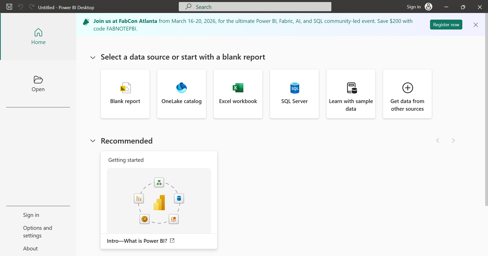

 Open Microsoft Power BI Desktop

<h3 align="center"> ✅Step 2: Load the Dataset</h3>

  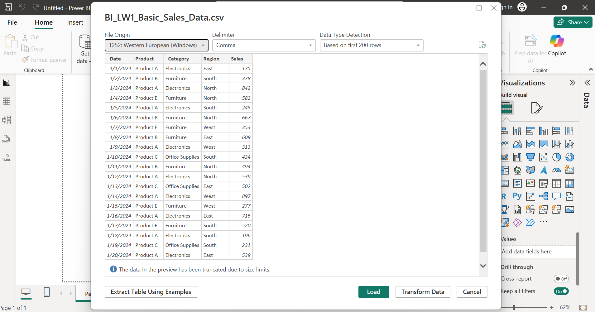

 Select the Text/CSV file given and load.

<h3 align="center">✅Step 3: Verify Data in Data View</h3>

  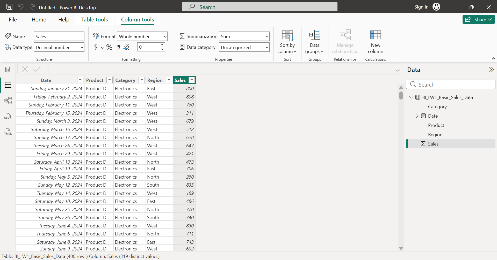

  Check if data types are correct and columns visible.

---
## PART 2: Exploring the Interface
<h3 align="center">✅Switch back to Report View.</h3>

  

---

## PART 3: Creating Auto-Generated Visuals
<h3 align="center">✅Step 1: Quick Visualization</h3>

  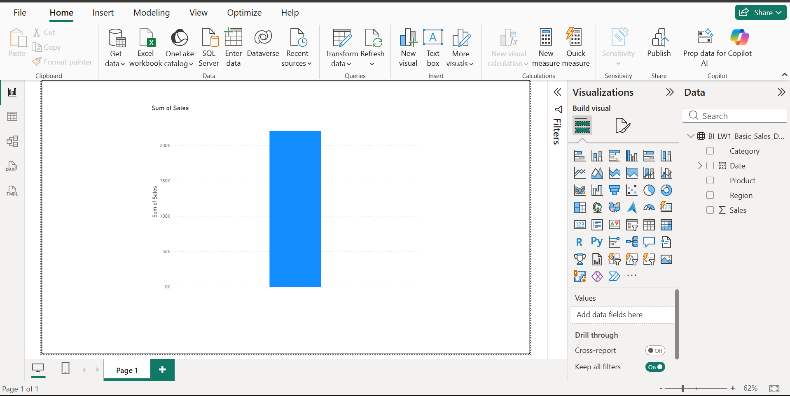

Power BI automatically creates a visual 

   
### Question:
**1. What type of chart was created?**
   
   Answer: **Power BI shows a clustered column chart when you drag a numeric field like Sales onto the canvas.**
  
**2. What does it show?**
  
   Answer: **It shows the total (Sum) of Sales for the entire dataset.**

<h3 align="center">✅Step 2: Create a Sales by Region Chart</h3>

  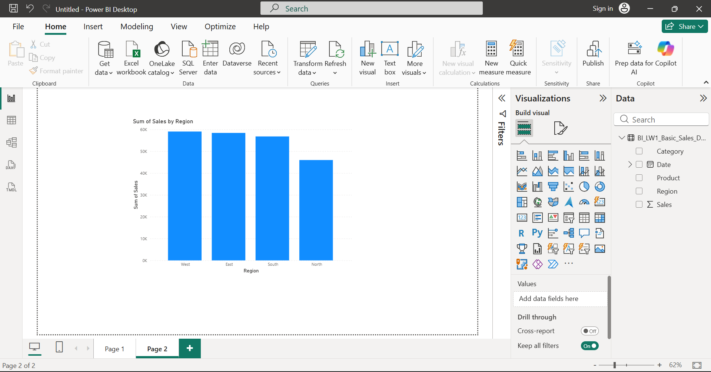

Clustered Column Chart of Sales per Region

### Question:
**Which region has highest sales?**

   Answer: **_WEST_ Region has the highest sales**

<h3 align="center">✅Step 3: Sales by Category</h3>

  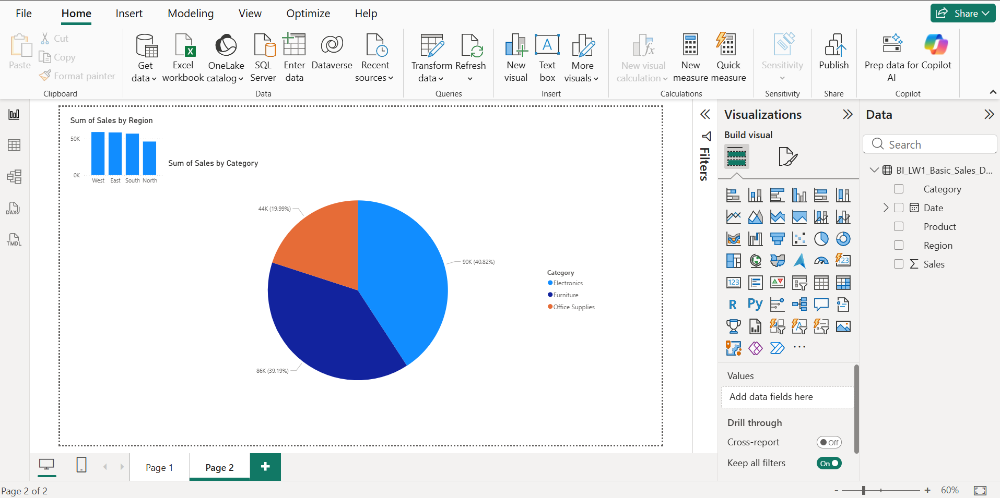

Pie Chart of Category and its corresponding total sales

### Question:
**1. Which category dominates?**

   Answer: **_Electronics_ dominate the sales with over 90K or 40.82% of the overall sales.**

**2. Is the distribution balanced?**

   Answer: **_Mostly Balance/ Not Balance_ but not perfectly as two categories (Electronics and Furniture) are fairly balanced with each other, but Office Supplies lags behind, so overall the distribution is slightly skewed, _not fully balanced_.**

<h3 align="center">✅Step 4: Sales Over Time</h3>

  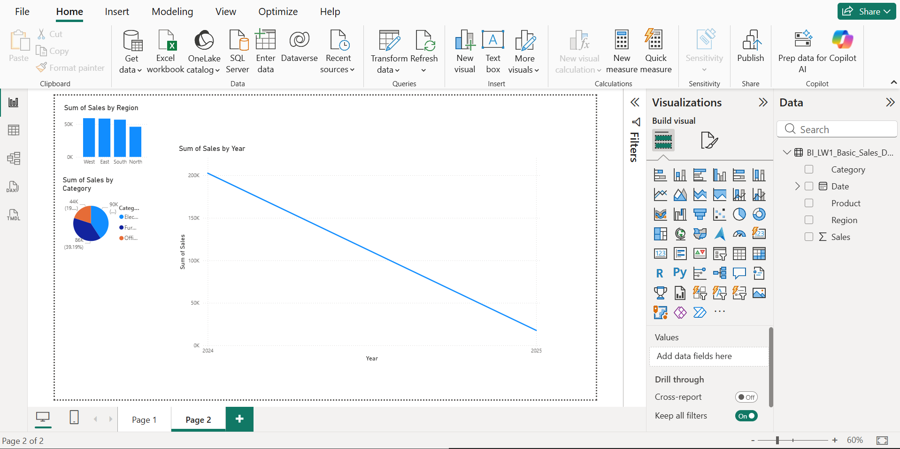

Line Chart of Sales within a period of time

### Question:
**1. Is there growth?**

   Answer: **No. There is no growth shown in the chart.**

**2. Any noticeable trend?**

   Answer: **Yes — a downward (declining) trend.**

   **Sales are high in 2024 (around 0.2M) and then Sales drop significantly in 2025 (close to 0.02–0.03M). The line slopes sharply downward, indicating a strong decrease year over year.**

   ### 📌 Interpretation:
   **_Sales declined from 2024 to 2025_**

----

## PART 4: Basic Data Insight Interpretation
Students must now interpret visuals.

## ❓Questions:
1. Which region contributes most revenue?
   
      Answer: **The _West region_ is the top revenue contributor, though the differences between regions are not very large.**

2. Which product category performs best?

      Answer: **_Electronics_ is the best performing category**

3. Are sales consistent across dates?

      Answer: **_No_ , sales are not consistent.**

4. What business recommendation can you suggest?

      Answer: **Maintain strong marketing and customer retention strategies in West Region and focus more in Electronics. Investigate also the sales drop in 2025 for future improvement. Boost weaker regions by regional promotions or localized strategies**

## ❔LABORATORY QUESTIONS:
### Part A – Technical Questions
1. What are the five columns in the dataset?
   
      Answer: **DATE, PRODUCT, CATEGORY, REGION and SALES.**
   
2. What data type is assigned to the “Sales” column?
      
      Answer: **DECIMAL NUMBER**
   
3. Which Power BI view allows you to see raw data?
   
      Answer: **DATA VIEW**
   
4. What chart type is best for showing trends over time?

      Answer: **LINE CHART**
   
5. What aggregation is automatically applied to Sales?

      Answer: **SUM OF SALES**

### Part B – Analytical Questions

6. Which region has the highest total sales?

      Answer: **WEST REGION has the highest total sales.**

7. Which category has the lowest performance?

      Answer: **OFFICE SUPPLY has the lowest performance.**

8. Are sales increasing, decreasing, or stable?

      Answer: **DECREASING**
   
9. If you were a manager, which region would you prioritize?

      Answer: **WEST REGION, as it has the highest revenue contributor and has strong marketing performance.**
   
10. Provide one actionable recommendation based on the data.
    
      Answer: **Focus marketing and inventory investment on Electronics in the West region.**

----
# ENHANCEMENT SECTION

<h3 align="center">✅Task 1: Add a Card Visualization</h3>

  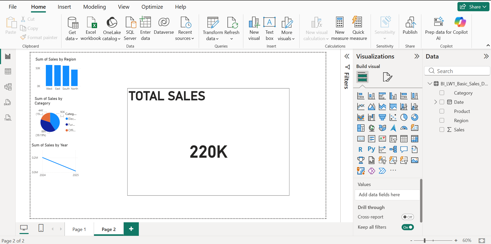

Card Visualization of Total Sales

### Question:
**What is the total sales amount?**

   Answer: **Total Sales is _220K_**

   <h3 align="center">✅Task 2: Add Slicer</h3>

  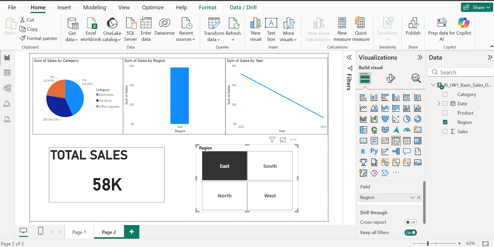

Test Filtering of Sales per Region

### Question:
1. What happens to other visuals when you click a region?

      Answer: **All other visuals update automatically to show data only for the selected region.**
   
2. Why is filtering important in BI?
   
      Answer: **It is important in enable to focus analysis and helps identify regional, product or time-based paterns for users to compare segments easily.**

<h3 align="center">✅Task 3: Sort Sales</h3>

  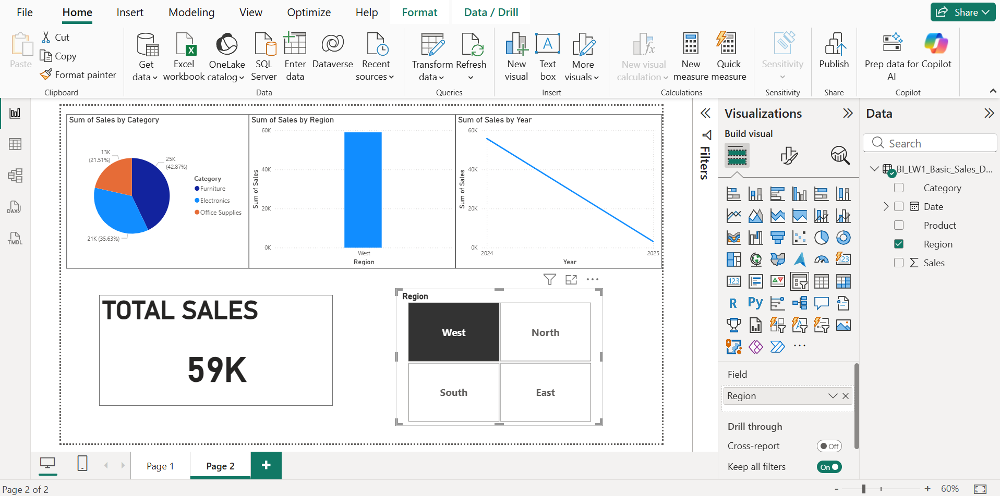

Sorting Sales by Descending Options

### Question:
1. Does sorting improve readability?
   
     Answer: **_YES_. It improves sorting readability.**

2. Why?

      Answer: **For better and easier comparison and reduces time in interpreting performances.**

<h3 align="center">✅Task 4: Identify Outliers</h3>

  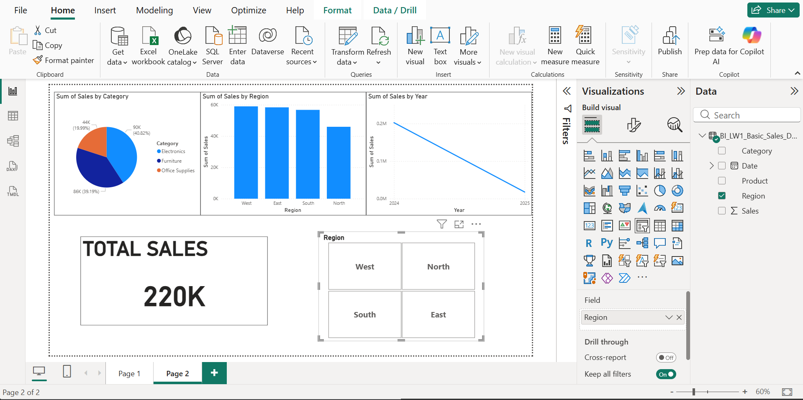

Highiest and Lowest Performance Region

1. Which region is significantly higher or lower?

      Answer: **WEST has the highest and NORTH as the lowest performance.**

2. What might explain that difference?

      Answer: **It might be because of the higher customer demand or population in the West or its stronger marketing and sales channels that leads to better product availability and distribution while the North has it otherwise.**

----

<h2 align="center">INSIGHT SUMMARY</h3>

----
  This laboratory activity demonstrated how Power BI can transform raw sales data into meaningful business insights through visualizations. Using a CSV dataset containing Date, Product, Category, Region, and Sales, various charts and interactive tools were created to analyze overall performance and trends.

  The West region recorded the highest total sales, making it the strongest market, while the North region had the lowest sales, indicating possible weaknesses in demand, distribution, or marketing. In terms of product categories, Electronics dominated total sales with over 90K (around 40.82%), making it the main revenue driver, while Office Supplies had the lowest contribution and may require improvement strategies.

  The sales trend analysis showed a major decline from 2024 to 2025, suggesting unstable performance that requires further investigation. To improve results, the company should strengthen strategies in the West region and Electronics category while addressing weak performance in the North region and Office Supplies. Lastly, the slicer feature highlighted Power BI’s dynamic filtering capability, allowing faster and more focused analysis across different regions and categories.
